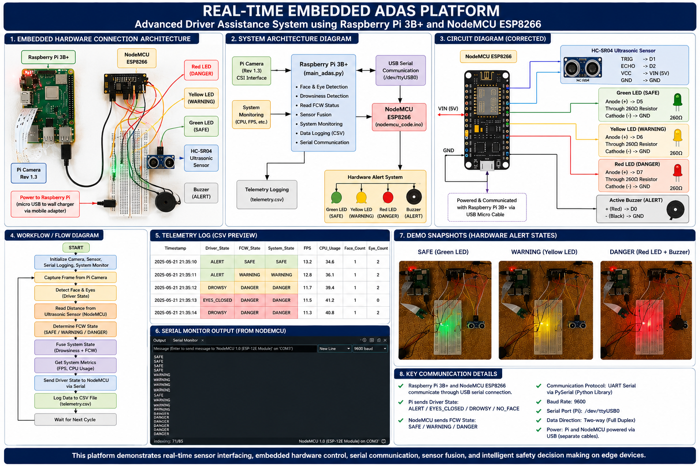
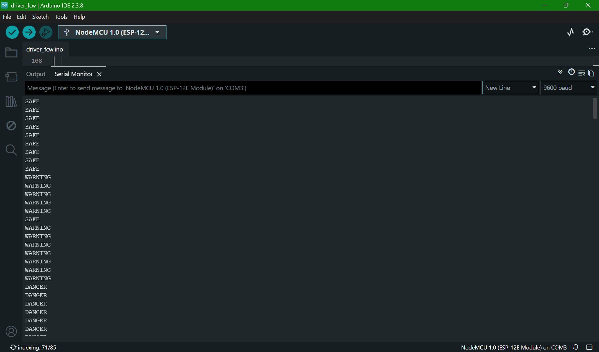
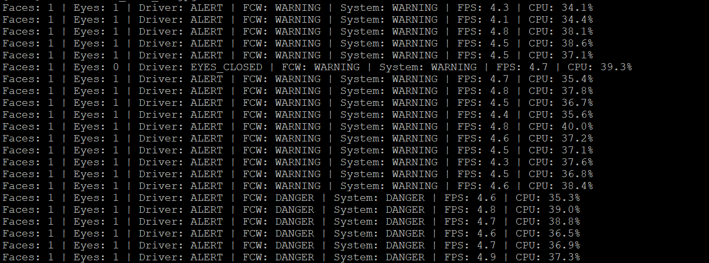
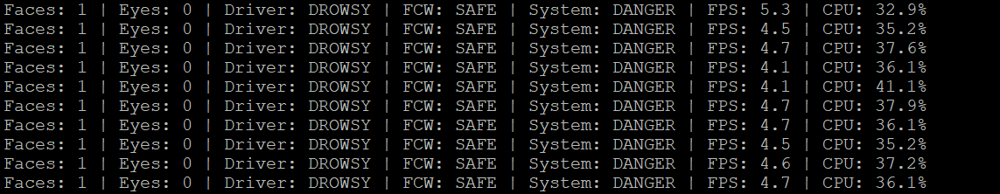

# REAL-TIME EMBEDDED ADAS PLATFORM

## Advanced Driver Assistance System using Raspberry Pi 3B+ and NodeMCU ESP8266

A real-time embedded Automotive Software Engineering project focused on:

- Driver Monitoring Systems
- Forward Collision Warning (FCW)
- Embedded Hardware-Software Co-Design
- Real-Time Sensor Fusion
- UART Serial Communication
- Edge AI Processing
- Embedded Safety Alert Systems

This project demonstrates practical implementation of concepts related to:

- Automotive Software Engineering
- Embedded Systems
- Real-Time Systems
- Intelligent Driver Assistance Algorithms
- Embedded Communication Architectures

---

# 🎥 Demo Video

Watch the complete project demonstration here:

[](https://youtu.be/yDbLcpdaAdY)

---

# 🚗 Project Overview

The system continuously monitors:

- Driver eye state
- Driver drowsiness
- Obstacle distance
- Forward collision risk
- Embedded system performance

The platform generates:

- Real-time visual alerts
- Audio buzzer alerts
- Embedded telemetry logs
- Live system state outputs
- Collision warning notifications

This project was designed as a low-cost embedded ADAS prototype inspired by real-world automotive safety systems.

---

# 🎯 Project Objectives

The primary objective of this project is to develop a real-time embedded ADAS platform capable of:

- Detecting driver drowsiness in real time
- Monitoring forward obstacle distance
- Performing embedded sensor fusion
- Generating automotive safety alerts
- Demonstrating embedded hardware/software integration
- Implementing UART-based serial communication
- Executing real-time edge AI workloads on Raspberry Pi

---

# 🧠 Automotive Software Engineering Concepts Demonstrated

This project aligns strongly with Automotive Software Engineering and Embedded Systems domains including:

- Embedded System Design
- Automotive Driver Assistance Algorithms
- Real-Time Data Processing
- Embedded Communication Systems
- Edge AI Deployment
- Sensor Fusion Architectures
- Hardware-Software Integration
- Embedded Safety Monitoring
- Real-Time Embedded Telemetry
- Serial Communication Protocols

---

# ⚙️ Features

## Driver Monitoring System

- Face detection using OpenCV Haar Cascades
- Eye detection for drowsiness monitoring
- Driver state classification:
  - ALERT
  - EYES_CLOSED
  - DROWSY
  - NO_FACE

---

## Forward Collision Warning (FCW)

- Ultrasonic distance measurement using HC-SR04
- Real-time collision risk estimation
- Distance-based alert classification:
  - SAFE
  - WARNING
  - DANGER

---

## Embedded Alert System

- Green LED → SAFE
- Yellow LED → WARNING
- Red LED → DANGER
- Active buzzer alerts for danger conditions

---

## Real-Time Embedded Monitoring

- FPS monitoring
- CPU usage monitoring
- CSV telemetry logging
- Console telemetry visualization
- Serial communication monitoring

---

# 🛠️ Hardware Used

| Component | Purpose |
|---|---|
| Raspberry Pi 3B+ | Main embedded computing platform |
| Raspberry Pi Camera Rev 1.3 | Driver monitoring |
| NodeMCU ESP8266 | Embedded FCW controller |
| HC-SR04 Ultrasonic Sensor | Distance measurement |
| LEDs | Visual safety alerts |
| Active Buzzer | Audio alert system |
| Breadboard + Jumper Wires | Embedded circuit connections |

---

# 💻 Software Stack

| Technology | Purpose |
|---|---|
| Python | Main ADAS application |
| OpenCV | Computer vision processing |
| NumPy | Numerical processing |
| PySerial | UART serial communication |
| Arduino IDE | NodeMCU firmware programming |
| Embedded C/C++ | FCW controller firmware |

---

# 🧩 System Architecture


---

# 🔌 Embedded Hardware Setup

## SAFE State


---

## DANGER State


---

# 📡 Serial Communication Monitoring



The Raspberry Pi communicates with the NodeMCU ESP8266 using USB UART serial communication through:

```bash
/dev/ttyUSB0
```

Communication Protocol:
- UART Serial Communication
- PySerial Library
- Baud Rate: 9600
- Full Duplex USB Serial Communication

Data Flow:
- Raspberry Pi → Driver state data
- NodeMCU ESP8266 → FCW processing and hardware alerts

Hardware Communication:
- Raspberry Pi connected to NodeMCU through USB to Micro-USB cable
- Serial device detected as:
  - `/dev/ttyUSB0`

---

# 📊 Real-Time Telemetry Outputs

## WARNING State Telemetry



---

## DROWSINESS Detection Telemetry



---

# 🔄 System Workflow

1. Raspberry Pi captures camera frames
2. OpenCV detects face and eyes
3. Driver state is classified
4. HC-SR04 measures obstacle distance
5. FCW state is determined
6. Sensor fusion combines driver + FCW states
7. Raspberry Pi sends state data via UART serial communication
8. NodeMCU activates LEDs and buzzer
9. Telemetry data is logged into CSV files

---

# 📂 Project Structure

```text
Real_Time_Embedded_ADAS_Platform/
│
├── docs/
│   └── project_notes.txt
│
├── hardware/
│   └── nodemcu_code/
│       └── nodemcu_code.ino
│
├── images/
│   ├── system_architecture.png
│   ├── safe_state.jpeg
│   ├── danger_state.jpeg
│   ├── serial_monitor_output.png
│   ├── telemetry_warning.png
│   └── telemetry_drowsy.png
│
├── logs/
│   └── adas_log.csv
│
├── scripts/
│   ├── main_adas.py
│   ├── fusion_adas.py
│   ├── integrated_adas_headless.py
│   ├── serial_test.py
│   └── main_adas_backup.py
│
├── requirements.txt
└── README.md
```

---

# ▶️ Installation

## Clone Repository

```bash
git clone https://github.com/ben002mr/Real_Time_Embedded_ADAS_Platform.git
```

---

## Install Dependencies

```bash
pip install -r requirements.txt
```

---

## Run Main ADAS System

```bash
python scripts/main_adas.py
```

---

# 📈 Future Improvements

- Deep learning-based driver monitoring
- Lane departure warning
- Real-time dashboard GUI
- CAN Bus communication
- AUTOSAR-inspired software architecture
- Automotive-grade embedded optimization
- TensorFlow Lite acceleration
- Multi-sensor fusion

---

# 🎓 Academic Relevance

This project demonstrates practical applications of:

- Automotive Software Engineering
- Embedded Systems Engineering
- Real-Time Systems
- Embedded Communication
- Intelligent Transportation Systems
- Edge AI
- Embedded Computer Vision

The implementation strongly aligns with modern automotive embedded software architectures and driver assistance technologies.
